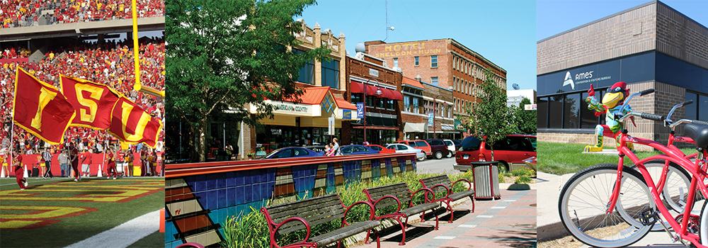

# Project 2 - Ames Housing Data and Kaggle Challenge

### Problem Statement
HGTV is interested in producing a new season of their successful show, Flip or Flop in Ames, Iowa. I was hired on as a Data Scientist to determine home features that would increase profit for home flips on the show. Consequently, I will be looking for which features of a home have the largest impact on sale price. Utilizing the data from the Ames Assessor’s Office, I will determine the best features that will impact the prediction of the sales price of a home in Ames, Iowa in order to help the Flip or Flop: Ames, Iowa show have a successful profit on flipped homes in the area. 

### Datasets & Data Dictionary

* 2006 to 2010 data set from the Ames Assessor's office used in determing assessed values for individual residental properties sold in Ames, Iowa.

|Feature|Type|Dataset|Description|
|---|---|---|---|
|**3ssn_porch**|*integer*|train_ols.csv|Kitchen quality. 1 is Poor and 5 is Excellent.| 
|**bsmt_cond**|*integer*|train_ols.csv|Evaluates the general condition of the basement. 0 is No Basement and 5 is Excellent.| 
|**bsmt_full_bath**|*integer*|train_ols.csv|Basement full bathrooms.| 
|**bsmt_half_bath**|*integer*|train_ols.csv|Basement half bathrooms.|
|**bsmt_qual**|*integer*|train_ols.csv|Evaluates the height of the basement. 0 is No Basement and 5 is Excellent.| 
|**condition_1**|*integer*|train_ols.csv|Proximity to various conditions. 1 means near a condition with Negative impacts, 3 means near a condition with positive impacts.| 
|**condition_2**|*integer*|train_ols.csv|Proximity to various conditions (if more than one is present). 1 means near a condition with Negative impacts, 3 means near a condition with positive impacts.| 
|**enclosed_porch**|*integer*|train_ols.csv|Kitchen quality. 1 is Poor and 5 is Excellent.|
|**exter_cond**|*integer*|train_ols.csv|Evaluates the present condition of the material on the exterior. 1 is Poor and 5 is Excellent.|
|**exter_qual**|*integer*|train_ols.csv|Evaluates the quality of the material on the exterior. 1 is Poor and 5 is Excellent.|
|**fireplaces**|*integer*|train_ols.csv|Number of fireplaces.| 
|**full_bath**|*integer*|train_ols.csv|Full bathrooms above grade.| 
|**functional**|*integer*|train_ols.csv|Home functionality (Assume typical unless deductions are warranted). 0 is Salvage only,7 is Typical Functionality.|
|**garage_area**|*float*|train_ols.csv|Size of garage in square feet.| 
|**garage_cars**|*float*|train_ols.csv|Size of garage in car capacity.| 
|**gr_liv_area**|*integer*|train_ols.csv|Above grade (ground) living area square feet.|  
|**half_bath**|*integer*|train_ols.csv|Half baths above grade.| 
|**lot_area**|*integer*|train_ols.csv|Lot size in square feet.| 
|**open_porch_sf**|*integer*|train_ols.csv|Kitchen quality. 1 is Poor and 5 is Excellent.| 
|**overall_qual**|*integer*|train_ols.csv|Rates the overall material and finish of the house. 1 is Very Poor, 10 is Very Excellent.| 
|**screen_porch**|*integer*|train_ols.csv|Kitchen quality. 1 is Poor and 5 is Excellent.| 
|**totrms_abvgrd**|*integer*|train_ols.csv|Total rooms above grade (does not include bathrooms).| 
|**wood_deck_sf**|*integer*|train_ols.csv|Kitchen quality. 1 is Poor and 5 is Excellent.| 
|**yr_built**|*integer*|train_ols.csv|Original construction date.| 
|**yr_remod/add**|*integer*|train_ols.csv|Remodel date (same as construction date if no remodeling or additions).| 
|**baths**|*integer*|train_ols.csv|Interaction Term = full_bath + (0.5 * half_bath) + bsmt_full_bath + (0.5 * bsmt_half_bath).|
|**bsmt_num**|*integer*|train_ols.csv|Interaction Term = bsmt_cond * bsmt_qual.||
|**condition_rank**|*integer*|train_ols.csv|Interaction Term = condition_1 * condition_2.| 
|**deck_or_porch**|*integer*|train_ols.csv|Interaction Term = wood_deck_sf * open_porch_sf * enclosed_porch * 3ssn_porch * screen_porch.| 
|**exter_num**|*integer*|train_ols.csv|Interaction Term = exter_cond * exter_qual.| 
|**garage_space**|*float*|train_ols.csv|Interaction Term = garage_area * garage_cars.|  
|**neighrborhood_rank**|*integer*|train_ols.csv|Neighborhood rank based on mean sale price per neighborhood. 1 is lowest average sale price. 28 is highest average sale price.| 
|**overall_qual_gr_liv_area**|*integer*|train_ols.csv|Interaction Term = overall_qual * gr_liv_area.| 
|**yr_remod_or_built**|*integer*|train_ols.csv|Interaction Term = yr_remod/add * yr_built.|
|**mszone_dum**|*integer*|train_ols.csv|Columsn representing the various MSZones including Agriculture, Commercial, Floating Village Residential, Industrial, Residential High Density, Residential Low Density, Residential Low Density Park, Residential Medium Density.|

### Brief Analysis 
After cleaning the datatset, three models were created to predict the sales price of an unknown list of homes: multiple linear regression, Lasso, and Ridge. 

Before evaluating the models, it is important to have a baseline to compare. The Baseline model here is the mean of the sale price. When the baseline model is used, the baseline has a Root Mean Squared Error of \\$79,277. The Root Mean Squared Error indicates that the errors are about \\$79,277 off from the actual sale prices. 

For the Ordinary Least Squares (OLS) Linear Regression model, the features that were identified as being the largest contributors to a successful sale price prediction were Overall Quality of the home, Overall Quality * Above Ground Living Area, Total Rooms Above Ground, Neighborhood Rank, Garage Space (Area * Cars), Year the home was remodeled or built, Functionality value, Number of Fireplaces, Exter Conditional Value, Lot Area, Condition Rank, Exterior value, Basement Value (Condition * Quality), Baths (Full and half including basement), Kitchen Quality Value, Deck or Porch Quality values, and all of the MS Zoning. This model showed some bias, but low variance. This model uses less features compared to the Ridge and Lasso models.  The Root Mean Squared Error indicates that the errors are about \\$28,552 off from the actual sale prices.

The Ridge model utilized all numerical features and assigned emphasized certain features. The Root Mean Squared Error is much smaller compared to the Linear Regression model. On average, the errors are about \\$23,975 off from the actual sale prices.

The best model was the Lasso model which used all of the numerical features in the dataset.  The Root Mean Squared Error is much smaller. On average, the errors are about \\$23,456 off from the actual sale prices. 

All three models were vast improvements on the baseline model. The Lasso model would have been chosen for the presentation as it provided the most accurate sale price predictions, however, due to time constraints, the OLS model will be presented. The coefficients for the LASSO model were created in a standardized form but were changed back to their original dollar value. It would be beneficial to go back and present this model when more time allows.  

### Conclusions & Recommendations

With the focus being features that will positively impact sale price of a home in Ames, Iowa, the OLS model was chosen for it's short list of features that are positively identify. In order to produce an accurate OLS model, sale prices were trasnformed to logarithms which means the coefficients are not able to be interpreted. However, the feautures with the most impact can be identified and highlighted. 

In order to increase the sale price of a flipped home in Ames, Iowa, our show should focus on Number of Fireplaces, producing a High Kitchen Quality, and Number of Bathrooms. Additionally, the highest impact was a combination of Overall Quality and Above grade (ground) living area square feet. The direct impact of each Overall Quality and Above Ground Living Area needs further investigation. 

Something else to consider when deciding which homes to flip, the Zoning Classification of the home does have a large impact. Homes that are in High and Low Density residential areas tend to have a larger positive impact on sale price. Commercially zoned areas have the largest negative impact on sale price. Happy flipping!
